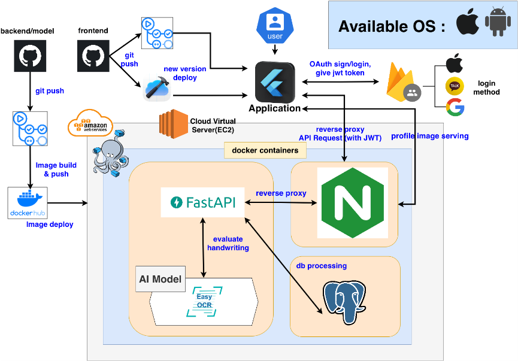

# 📘 AI-WritingCorrection  
### ✍️ AI-Based Handwriting Learning Platform

**AI가 손글씨를 인식·분석·교정해주는 스마트 학습 플랫폼**  
어린 학습자부터 성인까지 모두가 사용할 수 있는 맞춤형 글씨 교정 서비스

---

### 📱 Demo Video  
[🎬 시연 영상 1](https://youtu.be/hiKP2azsul4)  
[🎬 시연 영상 2](https://youtu.be/4Eiu8ARfBwU)

### 📦 APK 다운로드

  

---

---

## 🌟 프로젝트 소개

**AI-WritingCorrection**은 이미지 기반 글씨 분석뿐 아니라  
**획순(Stroke)** · **형태 비율** · **음소 구조** · **가독성(OCR)** 등  
다양한 요소를 종합적으로 평가하는 **4단계 심층 글씨 평가 모델**을 갖춘 손글씨 학습 플랫폼입니다.

기존 따라쓰기 위주의 손글씨 앱과 달리,  
**사용자의 실제 필기 데이터 분석 → 정교한 피드백 제공 → 성장 데이터 시각화**  
까지 제공하는 차별화된 구조를 가지고 있습니다.

---

## 🎯 주요 기능

### ✔ AI 기반 4단계 평가 알고리즘
1. **가독성 평가 (OCR)**
2. **전체 비율 분석 (Bounding Box)**
3. **획순 및 방향 평가 (Stroke Rules)**
4. **음소 비율 디테일 분석**

→ 단순 교정이 아닌 **세밀한 피드백 중심**의 글씨 교정

---

### ✔ 단계별 학습 시스템
- 자음/모음 → 글자 → 단어 → 문장  
- 제한시간 모드 / 자유 연습 모드  
- 난이도 기반 사용자 맞춤 학습  

---

### ✔ UI/UX 특징
- 종이 질감의 따뜻한 배경  
- 캐릭터(곰/토끼)를 통한 학습 동기부여  
- 태블릿 가로모드 최적화  
- Bottom Navigation 구조  

---

### ✔ 서버 및 데이터 관리
- 사용자 학습 기록 저장 및 통계 분석  
- 평가 점수/피드백/히스토리 관리  
- 미션 기록 및 단계별 진행도 제공  

---

## ⚙️ 기술 스택

### **Frontend**
- Flutter  
- Provider  
- CustomPainter 기반 필기 캔버스  

### **Backend**
- FastAPI  
- Python  
- EasyOCR 기반 AI 모델  
- Stroke Rule-Based Evaluation  

### **Infra**
- AWS EC2  
- Docker / Docker Compose  
- NGINX Reverse Proxy  

### **Database**
- PostgreSQL  

---

## 🏗 시스템 아키텍처

## 🔍 핵심 알고리즘 요약

AI-WritingCorrection의 평가 모델은 **가독성 → 형태 → 획순 → 음소 디테일**의  
4단계 정밀 분석 구조로 이루어져 있습니다.

### 🧠 4-Stage Handwriting Evaluation Pipeline

[ Input Image + Stroke Data ]  
↓  
1️⃣ OCR 기반 가독성 평가  
↓  
2️⃣ 전체 구조·비율 분석  
↓  
3️⃣ 획순 및 방향 평가  
↓  
4️⃣ 음소 형태/비율 정밀 분석  
↓  
[ Final Score + Feedback ]

---

## ✨ 1) 가독성 평가 (OCR + 자모 분석)

### 🔧 사용 기술
- EasyOCR 기반 텍스트 추출  
- 초성·중성·종성 분해  
- 자모 단위 유사도 비교  

### 📝 평가 방식
- OCR 결과와 정답을 비교  
- 불일치 시 자모 레벨 유사도 재판정  
- 세 단계 판정 제공  
  - **Perfect** — 완벽 일치  
  - **Candidate Pass** — 부분 일치  
  - **Fail** — 가독성 부족  

### ✔ 장점
- **자모 기반 정밀 분석 가능**  
- 어린 학습자·외국인 필체도 잘 인식함  

---

## ✨ 2) 전체 비율 평가 (Bounding Box Analysis)

### 🔧 사용 데이터
- 전체 글씨 이미지  
- 획이 존재하는 실제 영역  

### 📝 평가 방식
- Bounding Box 생성  
- 가로·세로 비율 및 전체 크기 비교  
- 감지 가능한 오류  
  - 지나치게 크거나 작은 글씨  
  - 가로로 늘어짐 / 세로로 길어짐  
  - 비정상적인 종횡비  

### ✔ 장점
- 글씨의 **전체 균형감 분석**에 최적화  

---

## ✨ 3) 획순 및 방향 평가 (Stroke Direction Evaluation)

### 🔧 사용 데이터
- 터치 시작점/종점 좌표  
- dx, dy 벡터  
- Rule-base 획순 데이터  

### 📝 평가 방식
- 음소 단위 분해  
- 벡터 방향 부호(+,–) 비교  
- 정답 규칙과 일치 여부 검증  

### ✔ 장점
- **쓰기 과정(Process)** 자체를 평가  
- 잘못된 필기 습관을 조기 교정 가능  

---

## ✨ 4) 음소 비율 분석 (Phoneme-Level Ratio Analysis)

### 🔧 사용 데이터
- 전체 글자 이미지  
- 획별 이미지  
- 정답 음소 비율 데이터  
- user_type  

### 📝 평가 방식
- 각 음소(ㄱ, ㄷ, ㅏ 등)의  
  - 가로·세로 길이  
  - 면적  
  - 전체 글자 대비 비율  
  을 산출 후 정답 비율과 비교  

- 감지되는 오류  
  - 크기 과대/과소  
  - 가로/세로 비율 왜곡  
  - 음소 구조 불균형  

### ✔ 장점
- “ㅏ의 가로폭이 좁아요”, “ㄷ의 세로 길이가 길어요” 같은  
  **초정밀 맞춤 피드백 제공**  

---

## 🧩 알고리즘 전체 요약

| 단계 | 평가 내용 | 사용 기술 | 결과 |
|------|------------|------------------------|---------------------------|
| **1단계** | 가독성 평가 | EasyOCR, 자모 분석 | 글자 인식 여부 판단 |
| **2단계** | 전체 구조 분석 | Bounding Box 비율 | 글씨 크기/비율 피드백 |
| **3단계** | 획순 평가 | Stroke 벡터 + Rule-base | 올바른 쓰기 과정 검증 |
| **4단계** | 음소 디테일 분석 | 음소별 비율·형태 분석 | 정교한 오류 탐지 |

---

## 👥 Team

| 팀원 | 이름 | 역할 |
|------|------|-------|
| 🧭 **Team Leader** | **정영진** | Front-end 개발 |
| 👥 **Team Member** | 박세환 | Front-end 개발 / Back-end 개발 |
| 👥 **Team Member** | 류효상 | 모델 개발 / 데이터 수집 및 정리 |
| 👥 **Team Member** | 신주원 | 모델 개발 / 데이터 수집 및 정리 |

---

## 📄 License

This project is licensed under the **MIT License**.

